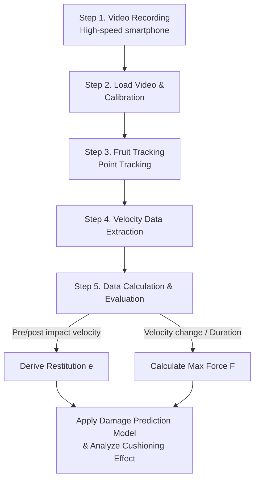

# Week 10 Lab Guide: Fruit Drop Impact Analysis using Tracker

## 1. Lab Overview
- **Objective**: Quantitative analysis of impact characteristics during fruit drop and the effectiveness of cushioning materials using high-speed smartphone recording and Tracker video analysis software.
- **Learning Outcomes**: Deriving the coefficient of restitution ($e$), measuring collision duration ($\Delta t$), calculating maximum impact force ($F$), and applying damage prediction models.

### 🔄 Overall Lab Workflow

## 2. Materials and Environment Setup
- Spherical fruit (apple, pear, tomato, etc.) x 1
- Smartphone (Model supporting slow-motion/high-speed recording recommended)
- Tripod (or smartphone mount)
- Tape measure / Ruler (for length calibration in video, 1m or longer)
- Cushioning materials (bubble wrap, sponge, corrugated cardboard, etc.)
- PC with Tracker video analysis software installed

### 📸 Experimental Setup Diagram

> [!TIP]
> To minimize perspective errors, ensure the camera lens is perpendicular to the fruit's drop trajectory. Also, place the tape measure at the exact same depth as the fruit's drop trajectory for accurate calibration.

## 3. Lab Procedures

### Step 1: Video Recording (Smartphone Slow Motion)
- **Environment Setup**: 
  - Fix the camera so its lens is perfectly horizontal and perpendicular to the drop trajectory.
  - Set up the tape measure right next to (or behind) the drop path so it is clearly visible in the frame.
- **Recording Process**:
  - Activate **Slow-motion (high-speed recording)** mode in the camera app (120fps or 240fps recommended).
  - Free-fall the fruit from a constant height (e.g., 1.0m).
  - **Record a total of 2 times**: 
    1. Drop on a Hard Surface
    2. Drop on a Soft Surface (Cushioning material)

### Step 2: Tracker Software Setup & Calibration
- **Load Video**: Launch Tracker and drag-and-drop the recorded video file.
- **Trim Video Clip**: 
  - Drag the black arrows at the bottom of the timeline to set the analysis section (from the moment the fruit leaves the hand to the moment it reaches its highest rebound peak).
- **Calibration (Distance Correction)**:
  - Select `Track` $\rightarrow$ `New` $\rightarrow$ `Calibration Tools` $\rightarrow$ `Calibration Stick` from the top menu.
  - While holding the `Shift` key, click on two points of the tape measure in the video and enter the actual length (e.g., `1.0`).
- **Coordinate System Setup**:
  - Click the purple `Axes` icon on the top menu.
  - Move the origin (center point) to the floor surface where the fruit impacts to set the $y=0$ reference point.

### Step 3: Fruit Tracking (Point Tracking)
- **Create Point Mass**: Select `Track` $\rightarrow$ `New` $\rightarrow$ `Point Mass`.
- **Manual Tracking**:
  - Hold the `Shift` key and click the exact center of the fruit.
  - As the video advances to the next frame, click the center again, tracking the entire pre- and post-impact process.
  - *(Tip: You can use the Autotracker feature for automatic tracking based on color contrast.)*

### Step 4: Data Extraction & Coefficient of Restitution ($e$) Calculation
- **Activate Velocity Graph**: Click the y-axis label on the right-side graph and change it to `y-velocity v_y`.
- **Measure Data**:
  - **$v_1$ (Velocity just before impact)**: Find the deepest trough (lowest point) in the negative (-) direction on the $v_y$ graph.
  - **$v_2$ (Velocity immediately after rebound)**: Find the highest peak (highest point) in the positive (+) direction right after the fruit hits the floor and starts bouncing up.
- **Calculate Result**:
  - Calculate the coefficient of restitution for both hard and soft surfaces: $e = \frac{|v_2|}{|v_1|}$

### Step 5: Impact Force ($F$) Calculation & Damage Prediction
- **Measure Collision Duration ($\Delta t$)**:
  - Measure the time difference across the section where the velocity drastically changes from negative (falling) to positive (rising) on the $v_y$ graph.
  - (Utilize the auto-calculated time based on the high-speed video frame rate).
- **Calculate Maximum Impact Force**:
  - Measure the mass of the fruit ($m$) using a scale.
  - Apply Newton's Second Law: $F_{avg} = m \cdot \frac{v_2 - v_1}{\Delta t}$ *(Calculate velocity change paying attention to the signs)*
- **Determine Damage Risk**:
  - Compare the calculated impact forces ($F$) for the hard and soft surfaces.
  - Evaluate the efficiency of the packaging/cushioning material by checking if the force exceeds the fruit tissue damage threshold (e.g., around 150 N for an apple), and write the final report.
