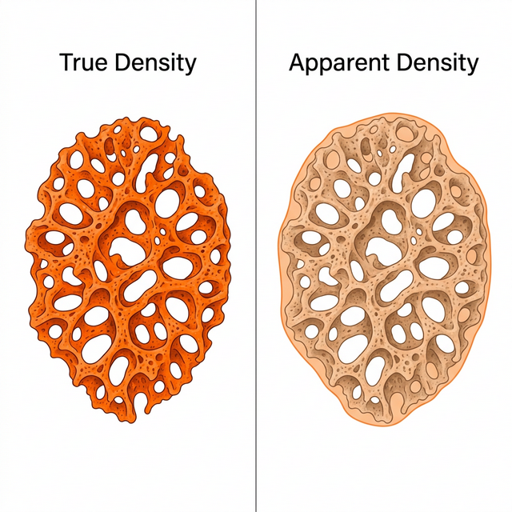
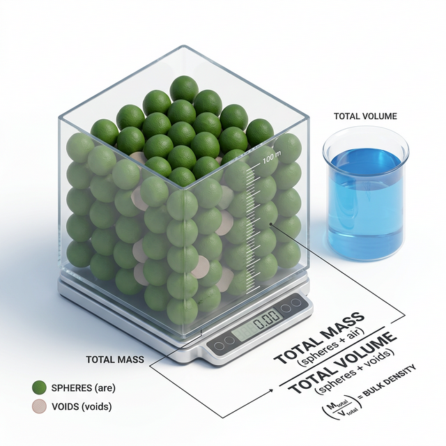
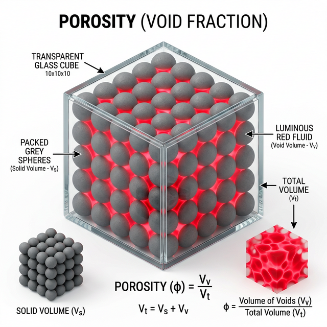
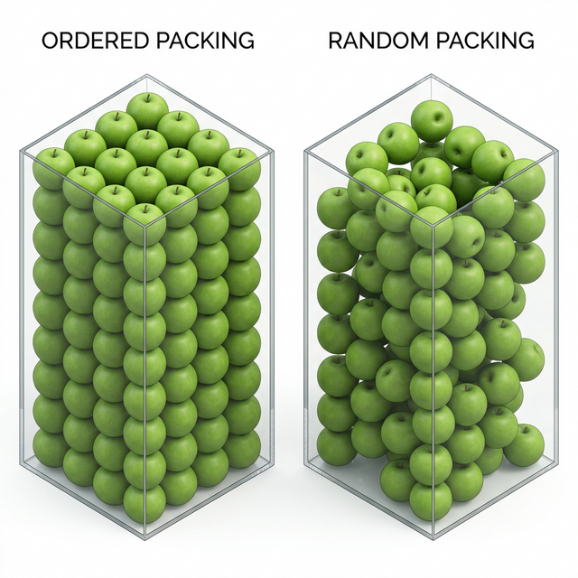

# 🥑 4주차: 곡물 및 과채류의 밀도와 공극률 실습
**– 생물소재 물리적 특성 연산 및 가상 3D 패킹 시뮬레이션 –**

> 📂 **탐색**: [← 3주차: 체적 및 표면적 추정](../week3/03주차_실습_체적_표면적.md) · [메인 README](../../README.md) · [📝 퀴즈 모음](../../QUIZ_BANK.md)

---

## 0. 실습 대상 데이터: 3주차 아보카도 연계

본 실습은 3주차 수치 적분으로 산출된 아보카도 체적 데이터와 가상의 포장 데이터를 활용하여 진행

| 항목 | 데이터 값 |
|------|-----|
| 대상 품목 | 아보카도 (Hass 품종) |
| 개별 체적 (Volume) | 205.4 cm³ (3주차 Simpson 적분 결과) |
| 개별 질량 (Mass) | 215.0 g (가상 저울 측정치) |
| 표준 포장 상자 (Box) | 가로 40cm × 세로 30cm × 높이 15cm (총 체적: 18,000 cm³) |
| 1박스 적재 수량 | 45개 |

---

## 1. 이론적 배경: 밀도와 공극률의 가공학적 중요성

### 1-1. 진밀도 (True Density) 및 겉보기 밀도 (Apparent Density)


- **개념**: 
  - `진밀도`: 대상 물질 자체의 순수한 밀도 (내부의 미세 기공/빈 공간을 부피에서 완전히 제외)
  - `겉보기 밀도`: 입자 내부의 기공(닫힌 공간)까지 포함한 전체 외형 체적을 기준으로 한 밀도
- **활용**: 품질 평가, 공기 역학적 특성(풍력 선별 등), 개체 질량/체적 추정
- **실습 적용**: 과채류는 내부에 큰 기공이 없다고 가정하여 진밀도와 겉보기 밀도를 유사하게 취급 (파티클 밀도, Particle Density)

### 1-2. 산물 밀도 (Bulk Density)


- **개념**: 다수의 생물자원을 용기에 적재했을 때 용기 전체 체적 대비 질량
- **활용**: 사일로(Silo) 및 물류 창고 저장 용적 설계, 운송 트럭 적재량 산출
- **특징**: 적재 방식, 다짐 정도(Compaction), 입자 형상에 따라 변화

### 1-3. 공극률 (Porosity)


- **개념**: 전체 산물 체적 중 비어있는 공간(Void)의 비율
- **활용**: 열풍 건조 시 공기 유동 저항 평가, 훈증 처리 가스 침투성 예측, 호흡열 배출 설계
- **산출 방법**:
  - `밀도 비율 기반` = 1 - (Bulk Density / Particle Density)
  - `실제 체적 기반` = (Void Volume / Box Volume)

---

## 2. 파이썬 알고리즘 실습: 밀도 및 공극률 계산

본 과정은 개별 객체의 특성을 군집 특성으로 확장하는 파이썬 데이터 처리 및 3D 시각화 파이프라인으로 구성

### 📝 [필수] 실습 환경 세팅 및 코드 실행 방법
1. **패키지 설치**: 로컬 터미널에서 필요 라이브러리 설치
   ```bash
   pip install numpy matplotlib scipy
   ```
2. **코드 파일 위치**: `week4/step1_density_porosity.py`, `week4/step2_advanced_apple.py`, `week4/step3_random_packing.py`
3. **코드 순차 실행**: 터미널에서 스크립트 실행
   ```bash
   python step1_density_porosity.py    # 아보카도 기본 실습
   python step2_advanced_apple.py      # 사과 심화 실습 (변수값 채운 뒤 실행)
   python step3_random_packing.py      # 3D 가상 패킹 시뮬레이션 (배열 vs 무작위 비교)
   ```

---

### 📊 파이썬 스크립트 핵심 단계 (Step 1 ~ Step 3)

#### 2-1. [Step 1] 개별 객체 밀도 (Particle Density)
- 입력 데이터(질량, 체적)를 통한 개별 밀도 연산
- 결과물이 물의 밀도(1.0 g/cm³)보다 큼 → 수조 세척 시 침강 예상

#### 2-2. [Step 2] 포장 산물 밀도 (Bulk Density)
- 박스 내 총 질량 산출 (단위 질량 × 총 적재 개수)
- 플라스틱 상자 총 체적 대비 밀도 평가

#### 2-3. [Step 3] 공극률 (Porosity) 상호 검증
- 서로 다른 두 가지 수식 알고리즘 비교
- **밀도 비율 공식** vs **실제 부피 차감 공식**의 결과 일치 검증

#### 2-4. [Step 1 시각화] 통합 데이터 시각화 (Visualization)
- **3D 가상 패킹 (Scatter)**: 박스 내 45개의 아보카도 배열 및 빈 공간(Void) 직관적 가시화
- **밀도 갭 분석 (Bar Chart)**: Particle vs Bulk 밀도 수치 비교
- **점유율 분석 (Pie Chart)**: 실체적 대비 공극률 점유 비율 확인

#### 2-5. [Step 3] 가상 패킹 시뮬레이션 비교 (Ordered vs Random)


- **목적**: 규칙적인 배열 형태(Ordered Grid) 대비 과일을 상자에 무작위로 쏟아넣었을 때(Random Packing)의 적재 개수 차이 수반
- **알고리즘**: 몬테카를로 난수 생성 및 3차원 충돌 감지(`scipy.spatial.distance.cdist`)를 통해 과일 간 중첩(Overlap)을 방지하는 알고리즘 구현
- **결과 확인**: 배열 패킹 방식에 비해 무작위 패킹 시 동일 체적 대비 적재 효율성(Packing Efficiency)이 급감하는 것을 3D 시각화로 비교 → **다짐(Compaction)이나 정렬 체계가 없을 때의 '산물밀도' 저하 현상 객관 증명**

#### 2-6. 🚀 [Advanced] 대상 품목 변경 실습: 사과(Apple) 데이터 적용
- **목적**: 기초 실습 코드를 응용하여 타 농산물의 물리적 특성 도출
- **실습 과제**: 기존 아보카도 변수를 아래 사과 데이터로 변경하여 `step2_advanced_apple.py` 실행 및 결과 분석
  - 단일 개체 체적 (`volume_single_cm3`): **315.0 cm³** (2주차 사과 기준)
  - 단일 개체 질량 (`mass_single_g`): **280.0 g**
  - 박스 적재 개수 (`apple_count`): **24개**
- **관찰 포인트**: 파티클 밀도의 변화(물에 뜨는지 가라앉는지) 및 형태 변화에 따른 공극률 수치 증감 비교

---

## 3. 💡 심화 토론 주제 (Discussion Topics)

### 토론 1: 형상(Shape)과 공극률(Porosity)의 상관관계
- **배경**: 원형에 가까운 과일과 불규칙한 모양을 가진 농산물은 박스 적재 시 공극 모양과 비율이 상이함
- **논제**: 아보카도 대신 구형도가 극히 높은 '토마토'나 길쭉한 형태의 '바나나'를 동일한 박스에 적재할 경우, 공극률 수치와 공기 유동 저항은 어떻게 변화할 것으로 예상되는가?

### 토론 2: 포장 상자의 다짐(Compaction) 효과
- **배경**: 운송 중 진동에 의해 농산물 적재 상태가 재배열됨
- **논제**: 트럭 운송 중 발생하는 진동이 Bulk Density와 Porosity에 미치는 영향과, 포장 박스 설계 시 이를 대비하기 위한 공학적 완충재(Buffer) 배치 전략 고안

### 토론 3: 벌크 밀도(Bulk Density)와 운송 물류비용 최적화
- **배경**: 산물 밀도(벌크 밀도)는 개별 객체의 밀도보다 낮으며, 포장 상자 내 빈 공간 비율(공극률)에 의해 직접적으로 결정됨
- **논제**: 대량 수출용 컨테이너에 사과나 아보카도를 적재할 때, 벌크 밀도를 극대화(공극률 최소화)하기 위한 패킹(Packing) 패턴 수학적 모델링(HCP, FCC 등)이 농산물의 압상(기계적 손상)에 미치는 트레이드오프(Trade-off)는?

### 토론 4: 진밀도와 겉보기 밀도의 구분이 가공 공정에 미치는 영향
- **배경**: 다공성 스펀지 조직을 가진 농산물이나 곡물 껍질 등은 미세 기공을 포함한 '겉보기 밀도'와 입자 자체의 '진밀도' 간의 격차가 확연히 다름
- **논제**: 진밀도와 겉보기 밀도의 차이(입자 내 공극률)가 열풍 건조 속도나 가공식품의 식감(Texture) 특성에 어떠한 물리적 영향을 미치는지 구체적인 사례를 들어 토론해 보자.

### 토론 5: 3D 가상 패킹 시뮬레이션의 계산 복잡도와 최적의 패킹
- **배경**: 4주차 파이썬 실습에서는 직교 격자 좌표계(`np.meshgrid`)를 사용하여 일정 간격으로 아보카도를 단순 배열(Ordered Packing)함
- **논제**: 실제 상자에 과일을 무작위로 쏟아 넣었을 때(Random Packing) 발생하는 '불규칙한 공극 분포'를 시뮬레이션하기 위한 난수 생성 및 충돌 감지(Collision Detection) 알고리즘의 계산 복잡도를 논의하고, 이를 최소화할 방법은 무엇일까?

### 토론 6: 수분 함량(Moisture Content) 변화에 따른 산물 밀도의 동적 변화
- **배경**: 농산물은 수확 후 보관 및 건조 과정을 거치며 내부 수분이 지속적으로 증발함. 이에 따라 개별 질량 수축과 부피 수축이 동시에 발생함
- **논제**: 장기간 사일로에 보관 중인 곡물의 수분 함량이 20%에서 12%로 감소했을 때, 질량 감소율과 부피 감소율의 차이에 의해 전체 용기의 '산물 밀도'와 '공극률'은 동적으로 어떻게 변화할 것인가?

---

## 4. 📝 평가용 퀴즈 문항 (Quiz Questions)

### Q1. [이론] 공극률(Porosity) 계산 공식
진밀도(Particle Density)와 산물밀도(Bulk Density)를 알고 있을 때, 공극률을 구하는 올바른 수식은?
- [ ] A. `(진밀도 / 산물밀도) × 100`
- [ ] B. `(산물밀도 / 진밀도) × 100`
- [x] C. `(1 - (산물밀도 / 진밀도)) × 100`
- [ ] D. `(진밀도 - 산물밀도) / 산물밀도 × 100`

### Q2. [실습] 3D 스캐터 시각화의 목적
`matplotlib` 3D Scatter에서 아보카도는 녹색, 공극(Void)은 붉은/시안색 잔점(반투명)으로 시각화했습니다. 이 시각화 기법의 가장 큰 교육적 목적은?
- [ ] A. 아보카도의 정확한 구형도 측정
- [ ] B. 색상 대비를 통한 해상도 최적화
- [x] C. 빈 공간(Void)의 분포와 차지하는 체적을 직관적으로 확인
- [ ] D. 박스 재질의 강도 예측

### Q3. [이론] 밀도 지표의 활용 범위
사일로(Silo)와 같은 거대 저장고의 전체 용적을 설계하기 위해 가장 우선적으로 고려해야 하는 물리적 지표는?
- [ ] A. 진밀도 (True Density)
- [ ] B. 겉보기 밀도 (Apparent Density)
- [x] C. 산물 밀도 (Bulk Density)
- [ ] D. 고체 밀도 (Solid Density)

### Q4. [파이썬 함수] 3D 격자 시각화 모듈
공간상에 아보카도를 X, Y, Z의 가상 3D 격자 좌표에 반복적으로 배치하기 위해 좌표 배열을 생성하는 파이썬 `numpy` 함수는?
- [x] A. `np.meshgrid`
- [ ] B. `np.linspace`
- [ ] C. `np.dot`
- [ ] D. `np.cross`

### Q5. [실습] 파티클 밀도 수치 분석
[Advanced] 실습에서 사과의 파티클 밀도를 연산한 결과, 0.889 g/cm³가 산출되었습니다. 이 사과를 수조를 이용해 수세(Washing) 공정을 거치게 할 때 나타나는 동역학적 특성은?
- [ ] A. 물에 가라앉는다
- [x] B. 수면에 위로 둥둥 뜬다 (부상)
- [ ] C. 중간층에 부유한다
- [ ] D. 알 수 없다

### Q6. [이론] 호흡열과 공극률의 관계
밀도와 공극률이 농산물 저장성(Storage Stability)에 직결된다고 할 때, '공극률이 지나치게 낮을 경우(꽉 들어찬 경우)' 수확 직후의 청과물(예: 사과, 배)에서 폭발적으로 발생할 수 있는 가장 치명적인 문제는?
- [ ] A. 수분 증발 가속화
- [ ] B. 저온 장해 발생
- [x] C. 통기성 불량에 의한 호흡열 축적 및 부패 가속화
- [ ] D. 자외선 노출 증가

### Q7. [파이썬 모듈] 거리 계산 및 충돌 감지
파이썬 코드에서, 3차원 격자의 무수한 점(Point Clouds)들과 객체 중심점 간의 거리를 일괄 계산하여 특정 반경 밖의 '공극(Void)'을 판별하는 데 사용된 `scipy` 모듈의 함수는?
- [x] A. `scipy.spatial.distance.cdist`
- [ ] B. `scipy.integrate.simpson`
- [ ] C. `scipy.interpolate.CubicSpline`
- [ ] D. `scipy.stats.linregress`

### Q8. [이론] 진밀도와 겉보기 밀도 적용 예외
과채류와 달리 진밀도와 겉보기 밀도를 동일하게 취급하기 가장 어려운 (즉, 내부 공극이 많은) 생물 자원의 형태는 다음 중 어느 것인가?
- [ ] A. 갓 수확한 단단한 사과
- [ ] B. 표면이 매끄러운 감자
- [x] C. 팽화 처리를 거친 곡물이나 두꺼운 스펀지형 껍질
- [ ] D. 내부가 과즙으로 꽉 찬 포도

---

## 5. 실습 결과물 버전 관리 및 GitHub 제출

- 본 과목은 주차별 과제를 하나의 마스터 저장소(Repository)에 누적 제출
- 자세한 GitHub 초기 연동 및 과제 제출(Push) 방법은 최상위 디렉터리의 [통합 실습 제출 가이드](../../README.md) 참조
